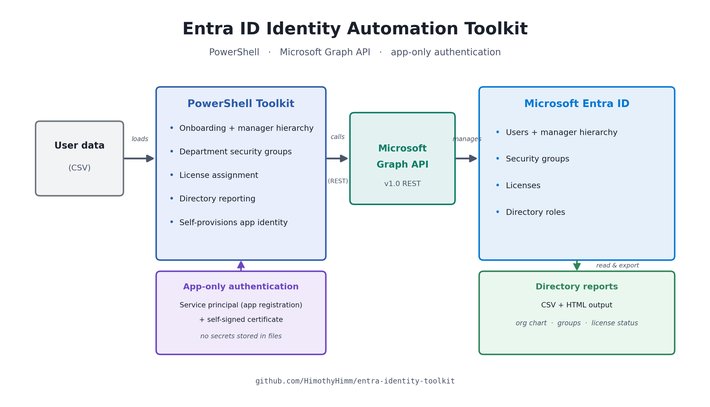

# entra-identity-toolkit

PowerShell automation for Microsoft Entra ID identity administration, built on the
Microsoft Graph API. Provisions users, manages department groups and licenses, and
reports on the directory — the kind of tooling an identity admin actually wants
instead of clicking through the Entra portal.

Built as a portfolio project alongside SC-300 (Microsoft Identity and Access
Administrator) study, by someone moving from enterprise IT support into cloud and
identity engineering.

## What it does

| Script | Purpose |
| --- | --- |
| `scripts/New-DemoUsers.ps1` | CSV-driven user onboarding: creates users with full attributes and a manager hierarchy. Idempotent, `-WhatIf` dry run, auto-resolves the tenant domain. Also seeds the demo population the rest of the toolkit manages. |
| `scripts/New-DepartmentGroups.ps1` | Creates one security group per department and bulk-adds members by their Department attribute. Idempotent, `-WhatIf`. |
Idempotent, `-WhatIf`, skips already-licensed users. |
| `scripts/Get-DirectoryReport.ps1` | Generates an org-chart + account inventory + license report, exported to CSV and a self-contained HTML file. |

## Approach

- **Microsoft Graph PowerShell SDK**, installing only the workload modules used
  (`Authentication`, `Users`, `Groups`, `Identity.DirectoryManagement`) rather than
  the full meta-module — leaner and faster to load.
- **Interactive delegated auth** (`Connect-MgGraph`) for development, with a clear
  path to an app registration + certificate for unattended execution.
- **Raw Graph (`Invoke-MgGraphRequest`) for reference operations** — manager links
  and group membership — because the SDK's `*ByRef` / `*Manager` cmdlets proved
  unreliable in this build (see Lessons learned).
- **Idempotent and `-WhatIf`-aware throughout**, so every script is safe to re-run
  and safe to preview.

## Setup

```powershell
# Workload modules (CurrentUser scope, no admin needed)
Install-Module Microsoft.Graph.Authentication            -Scope CurrentUser -Force
Install-Module Microsoft.Graph.Users                     -Scope CurrentUser -Force
Install-Module Microsoft.Graph.Groups                    -Scope CurrentUser -Force
Install-Module Microsoft.Graph.Identity.DirectoryManagement -Scope CurrentUser -Force

# Connect (pin the tenant so a personal account routes to the org directory)
Connect-MgGraph -TenantId "<your-tenant-id>" -Scopes `
  "User.ReadWrite.All","Group.ReadWrite.All","Organization.Read.All"
```

## Usage

```powershell
# 1. Seed users (dry run first)
.\scripts\New-DemoUsers.ps1 -CsvPath .\data\sample-users.csv -WhatIf
.\scripts\New-DemoUsers.ps1 -CsvPath .\data\sample-users.csv

# 2. Department groups + membership
.\scripts\New-DepartmentGroups.ps1 -WhatIf
.\scripts\New-DepartmentGroups.ps1

# 3. License assignment (requires an assignable SKU in the tenant)
.\scripts\Set-UserLicenses.ps1 -SkuPartNumber AAD_PREMIUM_P2 -WhatIf
.\scripts\Set-UserLicenses.ps1 -SkuPartNumber AAD_PREMIUM_P2

# 4. Directory report -> CSV + HTML in .\reports
.\scripts\Get-DirectoryReport.ps1
```

## Environment notes

- Runs on the **Entra ID Free** tier. User, group, manager, and reporting
  automation all work on free.
- **Licensing** needs an assignable SKU; a free tenant ships with none. The
  assignment script is complete and validated via `-WhatIf`; live assignment
  requires a paid or trial SKU (e.g. Entra ID P2).
- **Premium governance** — sign-in-based stale-account reports, PIM, access
  reviews — requires Entra ID **P1/P2** and is out of scope for the free tier.
- Run as a **cloud-only admin** inside the tenant
  (`admin@<tenant>.onmicrosoft.com`), not a personal Microsoft account guest —
  the Microsoft 365 admin center rejects personal accounts outright.

## Lessons learned

Real engineering notes from building this against a live tenant:

1. **Trust state, not logs.** `Set-MgUserManagerByRef` returned success while the
   directory never changed — a silent no-op. Dropping to the raw Graph REST call
   (`Invoke-MgGraphRequest`) wrote correctly and surfaced real errors. Both the
   read and write `*Manager` cmdlets are unreliable in this SDK build; raw Graph
   is the source of truth.
2. **PowerShell unrolls collections on return.** A function returning an *empty*
   `HashSet` collapsed to `$null`, which blew up the caller's `.Contains()`. Fixed
   with the unary comma operator: `return ,$ids`.
3. **Entra is eventually consistent.** Brand-new objects aren't immediately
   findable by `$filter`, and writes aren't immediately readable. Idempotent
   re-runs and short settle delays handle it.
4. **Personal account vs organizational account.** An Azure tenant created from a
   Gmail account routes Graph to the consumer MSA context unless `-TenantId` is
   pinned, and the M365 admin center won't accept the personal account at all. The
   fix is a cloud-only admin with a directory role.
5. **Mark of the Web.** Scripts downloaded via a browser are blocked under
   `RemoteSigned`. `Unblock-File` clears the tag; files extracted from a zip don't
   carry it.

## Next steps

- Unattended auth via app registration + certificate (headless / scheduled runs).
- Offboarding flow (disable, revoke sessions, strip licenses and group membership).
- P1/P2 governance demos (access reviews, PIM) once licensed.
